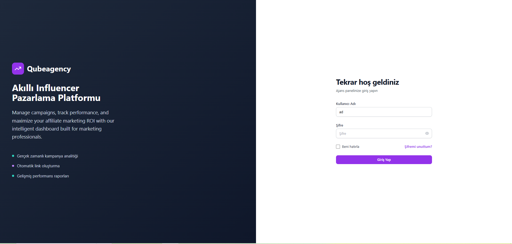
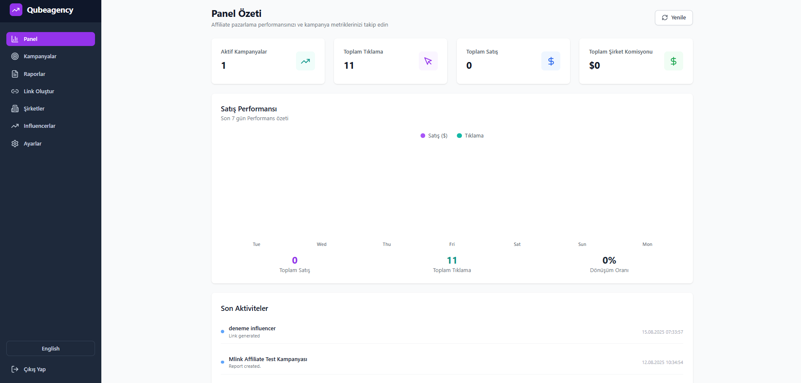
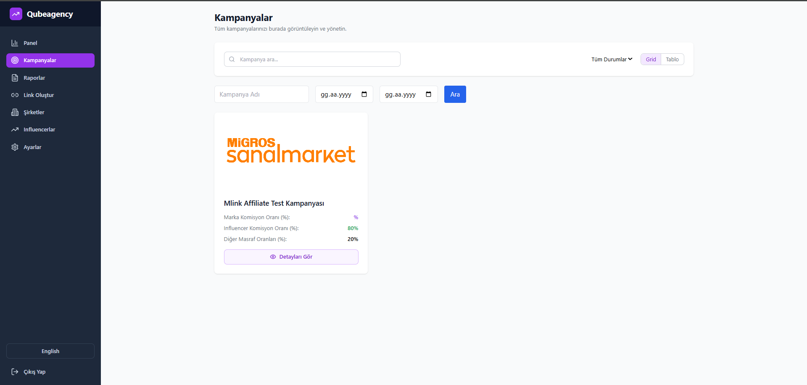
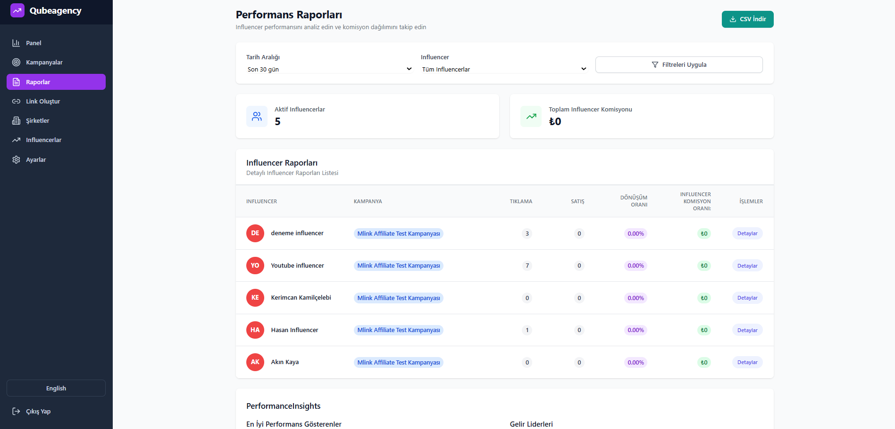
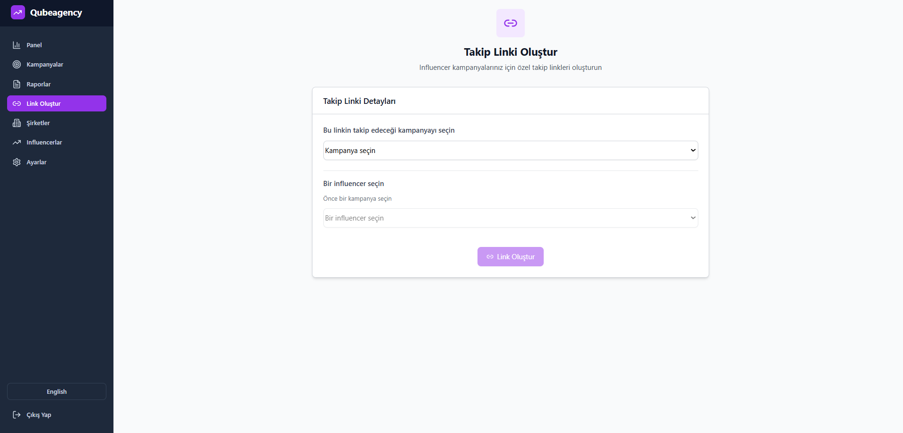
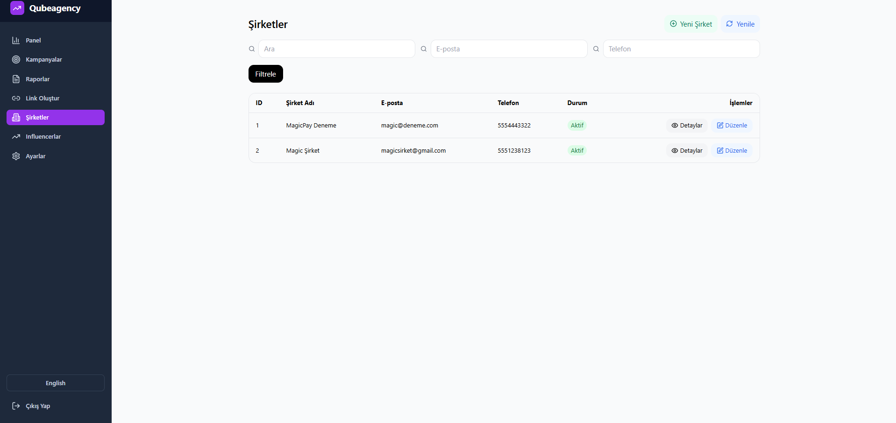
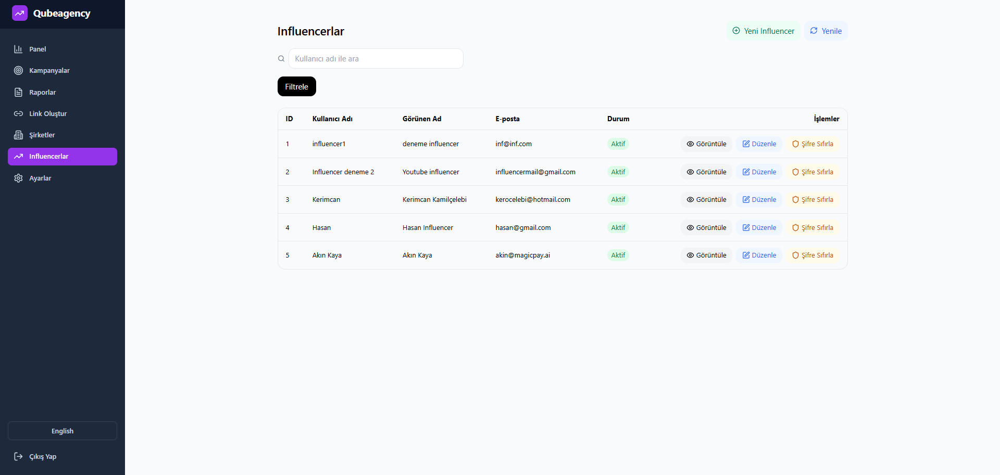

# InfluencerAgency

Bu proje, **influencer'lar için bir affiliate marketing uygulaması** olarak geliştirilmiştir.  
Kullanıcılar, ürünleri tanıtarak gelir elde edebilir ve performanslarını takip edebilirler.

---

## 🚀 Başlangıç

### 📥 Projeyi Klonlama

Projeyi bilgisayarınıza klonlamak için aşağıdaki komutu kullanabilirsiniz:

```bash
git clone https://github.com/Kerimcan19/InfluencerAgency.git
```

---

⚙️ Kurulum

Projeyi kurmak için aşağıdaki adımları izleyin:

Gerekli bağımlılıkları yüklemek için:
```bash
pip install -r requirements.txt
```

Projeyi başlatmak için:
```bash
python main.py
```

Bu adımlar, projeyi yerel geliştirme ortamınızda çalıştıracaktır.

---

🛠️ Kullanılan Teknolojiler

Backend: Python, FastAPI

Veritabanı: SQLite

Frontend: HTML, CSS, JavaScript

---

📸 Ekran Görüntüleri








